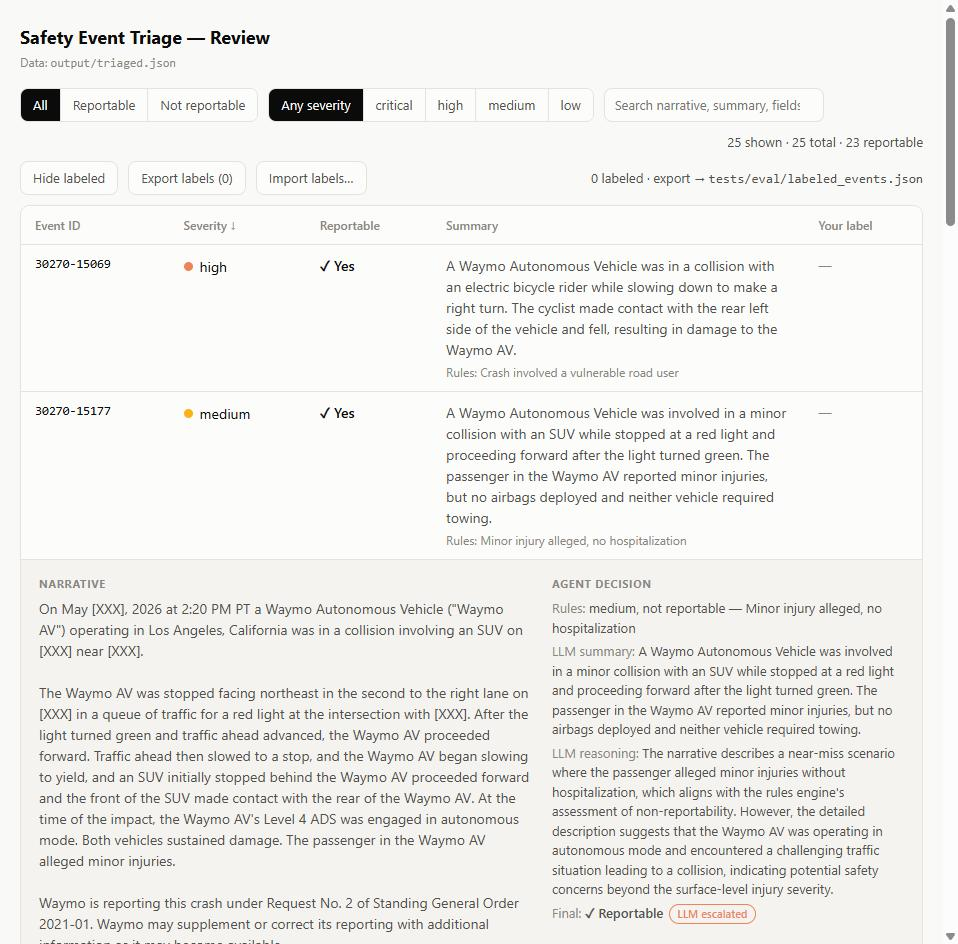

# Safety Event Triage Agent


**The problem.** Teams operating vehicle fleets, factories, or field crews
get a continuous feed of safety events (crashes, near-misses, injury
reports) under hard regulatory clocks: NHTSA's Standing General Order
gives AV operators as little as one day to report a qualifying crash;
OSHA gives employers 24 hours for an in-patient hospitalization. Missing
a report risks fines and consent orders; flagging everything buries
reviewers until they rubber-stamp. The real job is *triage*, deciding
fast which events deserve a human's attention, and today it mostly
happens in a spreadsheet.

**What this is.** A local, config-driven agent that reads any tabular
safety-event dataset (crash reports, near-miss logs, incident logs, 
anything with structured fields + a free-text narrative), classifies
severity, drafts a plain-language summary, and flags events that likely
need regulatory reporting.

**Why fully local.** Everything runs on your own machine against a local
model through Ollama. No data, and no API key, ever leaves your
computer. That's not a preference, it's the constraint that shapes the
design: safety-event data is often sensitive (PII, confidential business
information, government reporting requirements), which rules out the
default "call a cloud API" architecture from day one.

Demoed against a **real, public dataset**: NHTSA's Standing General Order
(SGO) crash reports for Automated Driving Systems, the same kind of data
an AV safety platform would ingest, but fully open and legally safe to use
for a demo/portfolio project.



## How it's general-purpose

Nothing in the pipeline is hard-coded to NHTSA's column names. A single
YAML config file maps *your* dataset's columns onto a small canonical
schema, plus the thresholds/keywords used for rule-based classification.
Point it at a different CSV (a fleet telemetry export, a workplace incident
log, a near-miss report from a completely different domain) by writing a
new config file, the code doesn't change.

This isn't just a claim: the repo ships **two** configs for two unrelated
domains, driving the identical code, 

- `config/nhtsa_sgo_ads.yaml`: NHTSA AV crash reports (keyword rules on
  injury/crash-partner fields, a numeric pre-crash-speed threshold)
- `config/osha_severe_injury.yaml`: [OSHA Severe Injury
  Reports](https://www.osha.gov/severe-injury-reports) (workplace injuries;
  numeric rules mirroring OSHA's statutory reporting triggers, 
  amputation, hospitalization, loss of an eye)

Both are covered by tests against real sampled rows from each dataset.

```
triage/
├── config/
│   ├── nhtsa_sgo_ads.yaml      # NHTSA AV crash reports
│   └── osha_severe_injury.yaml # OSHA workplace severe-injury reports
├── triage/
│   ├── schema.py               # loads config, normalizes any row -> canonical event
│   ├── rules.py                # deterministic severity/reportability rules
│   ├── llm_client.py           # talks to a local Ollama model, real tool-calling
│   └── pipeline.py             # ties it together, writes results
├── eval/run_eval.py            # measures agent-vs-human-label agreement
├── dashboard.html              # zero-dependency review & labeling workbench
├── fetch_data.py               # downloads real NHTSA SGO CSVs
├── main.py                     # CLI entry point
└── docs/                       # spec, task log, product decision log
```

## Setup

1. Install Ollama (https://ollama.com) and pull a tool-calling capable model.
   Good options for a 16GB-VRAM card:
   ```
   ollama pull qwen2.5:14b
   # or: ollama pull llama3.1:8b   (lighter/faster, still supports tools)
   ```
2. Install the package (editable, with dev/test extras):
   ```
   pip install -e '.[dev]'
   ```
3. Get real data (or drop in your own CSV):
   ```
   python fetch_data.py
   ```
4. Run the agent:
   ```
   python main.py --input data/sgo_ads.csv --config config/nhtsa_sgo_ads.yaml \
       --output output/triaged.json --limit 25 --model qwen2.5:14b
   ```
   Drop `--model`/omit Ollama entirely and add `--no-llm` to dry-run just the
   deterministic rules (useful for testing without waiting on the LLM, or
   without Ollama installed at all).

## How classification works

Two layers, on purpose, you don't want an LLM as your only safety gate:

- **`rules.py`**: deterministic, auditable, config-driven thresholds
  (fatality, vulnerable road user struck, airbag deployment, tow-away,
  high pre-crash speed, etc.). This produces a `rule_severity` and
  `rule_reportable` flag that a human could reproduce by hand from the
  config alone.
- **`llm_client.py`**: the local model reads the narrative + structured
  fields and (a) drafts a plain-language summary a non-engineer could read,
  and (b) makes a judgment call on ambiguous cases via a real tool call
  (`assess_reportability`), which can *escalate* a rule-based "not
  reportable" to reportable if the narrative describes something the
  structured fields miss, but never silently downgrades a rule-flagged
  event. The rules are the floor; the LLM adds judgment on top of it, not
  instead of it.

Every one of these choices falls out of a single asymmetry: a **false
negative** (a missed reportable event) is a regulatory violation, while a
**false positive** costs a reviewer a few minutes. The deterministic
floor, the escalate-only LLM, and the eval harness's emphasis on false
negatives all encode that asymmetry. The full reasoning, including the
alternatives that were rejected, lives in
[`docs/DECISIONS.md`](docs/DECISIONS.md).

## Measured results

Sixty real NHTSA events were hand-labeled for ground truth (drafted with
an LLM assistant, then human-reviewed event by event, including
deliberate disagreements with the rules engine; labeling standard
documented in [`docs/DECISIONS.md`](docs/DECISIONS.md), decision 3).
Running `eval/run_eval.py` with `qwen2.5:14b` against those labels:

| Configuration | Agreement | False negatives | False positives |
|---|---|---|---|
| Rules only | 95% (57/60) | 3 | 0 |
| Rules + LLM escalation | 32% (19/60) | **0** | 41 |

Three takeaways, in the order a triage product cares about them:

1. **Zero false negatives end-to-end.** The three events the rules engine
   missed are visible only in the narrative, an alleged minor injury, a
   dog struck at 28 mph, an AV driving under a closing railroad gate, 
   and the LLM escalation caught all three. The floor-plus-escalation
   design did exactly what it was built for.
2. **The deterministic floor alone is strong**: 95% agreement with human
   judgment, no false positives, and every miss was a narrative-only case
   no structured-field rule could see.
3. **Escalation precision is the open problem.** The LLM also escalated
   41 events a human reviewer would clear, a feed that's 87% flagged
   isn't triaged. That number is now the tuning target: the labeled set
   makes every prompt change to `llm_client.py` measurable with one
   command instead of a vibe check.

## Reviewing & labeling results

**[Project site](https://nktarasios.github.io/triage/)** (interactive demo) · **[Live workbench](https://nktarasios.github.io/triage/dashboard.html)**, 
the workbench loaded with 25 real NHTSA events triaged by the full
rules + LLM pipeline (`docs/demo/sample_triaged.json` is a committed
snapshot; everything else in `output/` stays generated-and-gitignored).

`dashboard.html` is a zero-dependency review workbench for the output JSON.
Serve the repo folder over HTTP (browsers block `fetch()` on `file://`):

```
python -m http.server
# open http://localhost:8000/dashboard.html?data=output/triaged.json
```

Filter by reportable flag or severity, search across narratives/fields, and
click any row to expand the full narrative, the structured fields, and the
agent's reasoning (rules vs LLM, with escalations flagged). You can also
record your own reportable/not-reportable judgment plus notes per event, 
labels persist in the browser's localStorage and export as JSON in exactly
the schema `eval/run_eval.py` expects. Save the export as
`tests/eval/labeled_events.json` and run `python eval/run_eval.py` to
measure agreement (false negatives are flagged prominently).

## Adapting to a new dataset

Copy `config/nhtsa_sgo_ads.yaml`, edit the `fields:` block to point at your
CSV's actual column names, and adjust `rules:` to your severity thresholds
(e.g. swap "vulnerable road user struck" for "deceleration_g > 0.5" or
"min_distance_m < 5" if your dataset has raw telemetry instead of post-hoc
crash categories, the rules engine supports both keyword rules and numeric
threshold rules out of the box).

## Development status & roadmap

The core (`triage/`, `main.py`, `config/`) is built and validated against
the real dataset. Tests, packaging, hardening, and an eval harness are
tracked in [`docs/SPEC.md`](docs/SPEC.md) (detailed spec) and
[`docs/TASKS.md`](docs/TASKS.md) (checklist): that's the handoff doc for
continuing this with an AI coding agent. [`AGENTS.md`](AGENTS.md) is the
canonical project-instructions file (Cursor reads it natively); `CLAUDE.md`
is a one-line pointer to it for Claude Code users, so nothing has to be
kept in sync across two files.

## Known limitations

**The LLM over-escalates.** Now quantified in [Measured
results](#measured-results): against 60 hand-labeled events the LLM
escalated 41 a human reviewer would clear, its reasoning leans on
counterfactuals ("could have caused more severe damage if…") rather than
what actually happened. A triage agent that flags 87% of a feed isn't
triaging. The labeled set exists precisely to tune the escalation prompt
against; the deterministic rules floor is unaffected, escalation only
ever adds review work, never hides a rules-flagged event.

**Local-model quirks are real.** Example found during that same run:
qwen2.5 via Ollama's OpenAI-compatible endpoint silently stops emitting
tool calls when a system-role message is combined with tool definitions
(the client now folds instructions into the user message as a
workaround). If you swap models, run a small `--limit` batch first and
check the summaries aren't falling back to "(model did not return a
structured result)".

## How it was built

Built AI-assisted under the staged research → plan → test → implement →
validate → review process documented in
[AI-SDLC](https://github.com/nktarasios/AI-SDLC).

## Note on the NHTSA demo data

Because the NHTSA SGO dataset *is itself* the set of already-reported
crashes, most rows will legitimately flag as "reportable", that's expected
and not a bug. The value in a real deployment is triaging a raw *pre-report*
event stream (where most events are benign) down to the ones worth a
human's attention, plus turning structured fields into a fast, readable
summary. Swap in a noisier upstream dataset to see the triage/filtering
behavior more dramatically.
